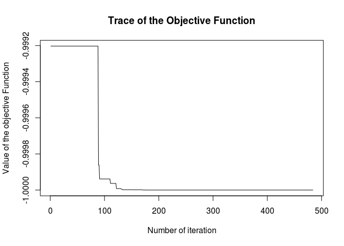

ABCoptim: An implementation of the Artificial Bee Colony (ABC) Algorithm (R-package)
====================================================================================

This is an implementation of Karaboga (2005) ABC optimization algorithm. It was developed upon the basic version programmed in *C* and distributed at the algorithm's official website (see the references).

Any evident (precision) error should be blamed to the package author (not to the algorithm itself).

Example
=======

``` r
library(ABCoptim)

# Function to optimize. Min at (pi,pi)
fun <- function(x) {
  -cos(x[1])*cos(x[2])*exp(-((x[1] - pi)^2 + (x[2] - pi)^2))
}

# Since it is stochastic, we need to set a seed to get the same
# results.
set.seed(123)

# Finding the minimum
ans <- abc_optim(rep(10,2), fun, lb=-20, ub=20, criter=200)
ans
```

    ## 
    ##  An object of class -abc_answer- (Artificial Bee Colony Optim.):
    ##  par:
    ##     x[1]:  3.141593
    ##     x[2]:  3.141593
    ## 
    ##  value:
    ##           -1.000000
    ## 
    ##  counts:
    ##            484

``` r
plot(ans)
```



Authors
=======

George G. Vega Yon \[aut\]

Enyelbert Muñoz \[cnt\]

References
==========

D. Karaboga, *An Idea based on Honey Bee Swarm for Numerical Optimization*, tech. report TR06,Erciyes University, Engineering Faculty, Computer Engineering Department, 2005 <http://mf.erciyes.edu.tr/abc/pub/tr06_2005.pdf>

Artificial Bee Colony (ABC) Algorithm (website) <http://mf.erciyes.edu.tr/abc/index.htm>

Basic version of the algorithm implemented in 'C' (ABC's official website) <http://mf.erciyes.edu.tr/abc/form.aspx>
