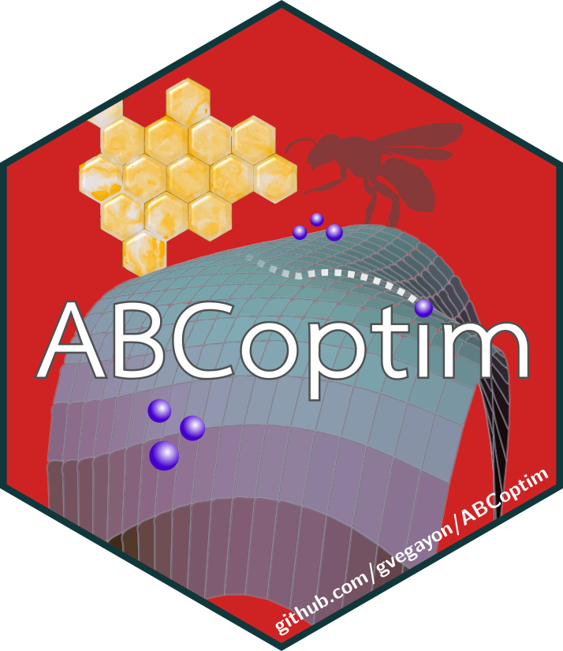

```{r include=FALSE}
knitr::opts_chunk$set(fig.path = "man/figures/", warning = FALSE)
```

```{=markdown}
[](https://github.com/gvegayon/ABCoptim/actions/workflows/r.yml)
[](https://github.com/gvegayon/ABCoptim/actions/workflows/pkgdown.yaml)
[](https://cran.r-project.org/package=ABCoptim)
[](http://cran.rstudio.com/package=ABCoptim)
[](http://cran.rstudio.com/package=ABCoptim) 
[](https://codecov.io/gh/gvegayon/ABCoptim)
[](https://zenodo.org/badge/latestdoi/13732591)
[](https://github.com/sponsors/gvegayon)
```


# ABCoptim {height=128px align="right"}


<!-- how-to-cite -->
> [!NOTE]
> **How to cite ABCoptim.** If you use **ABCoptim** in published work, please cite it:
>
> Vega Yon G, Muñoz E. *ABCoptim: Implementation of Artificial Bee Colony (ABC) Optimization*. doi:[10.32614/CRAN.package.ABCoptim](https://doi.org/10.32614/CRAN.package.ABCoptim)
>
> Run `citation("ABCoptim")` in R for the BibTeX entry.
<!-- how-to-cite -->

This is an implementation of Karaboga (2005) ABC optimization algorithm. It was developed upon the basic version programmed in *C* and distributed at the algorithm's official website (see the references).
  
Any evident (precision) error should be blamed to the package author (not to the algorithm itself).

# Example

```{r example1}
library(ABCoptim)

# Function to optimize. Min at (pi,pi)
fun <- function(x) {
  -cos(x[1])*cos(x[2])*exp(-((x[1] - pi)^2 + (x[2] - pi)^2))
}

# Since it is stochastic, we need to set a seed to get the same
# results.
set.seed(123)

# Finding the minimum
ans <- abc_optim(rep(10,2), fun, lb=-20, ub=20, criter=200)
ans

plot(ans)
```


References
==========

D. Karaboga, _An Idea based on Honey Bee Swarm for Numerical Optimization_, tech. report TR06,Erciyes University, Engineering Faculty, Computer Engineering Department, 2005 http://mf.erciyes.edu.tr/abc/pub/tr06_2005.pdf

Artificial Bee Colony (ABC) Algorithm (website) http://mf.erciyes.edu.tr/abc/index.htm

Basic version of the algorithm implemented in 'C' (ABC's official website) http://mf.erciyes.edu.tr/abc/form.aspx


## Code of Conduct
  
Please note that the ABCoptim project is released with a [Contributor Code of Conduct](https://contributor-covenant.org/version/2/1/CODE_OF_CONDUCT.html). By contributing to this project, you agree to abide by its terms.
